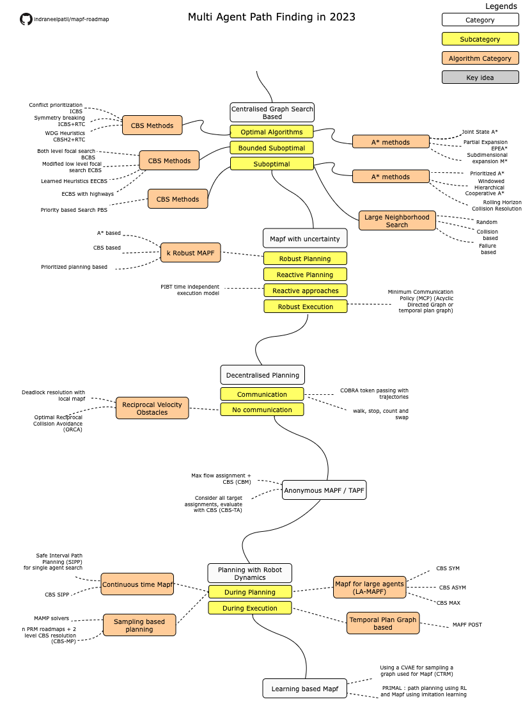

# mapf-roadmap
Roadmap of topics in multi agent path finding in 2023

### Credits
This roadmap is based on 16-891 Multi Robot Planning and Coordination offered by Prof. Jiaoyang Li at CMU https://jiaoyangli.me/research/mapf/

### Roadmap

